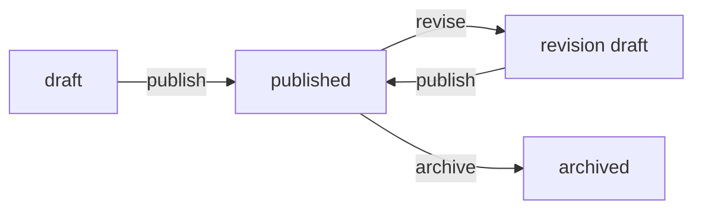

DocInject documents move through a defined lifecycle: `draft` → `published` → archived, with revision drafts branching off published versions. These endpoints let you drive that lifecycle programmatically and manage the sharing and assignment features tied to each document.

## Document lifecycle overview



---

## Publish a document

```
POST https://api.docinject.io/api/v1/documents/{doc_id}/publish
```

Publishes a draft document, setting its status to `published` and recording a `published_at` timestamp. Fires a `document.published` webhook event (or `document.revised` if this is a revision draft).

<Note>
  Publishing consumes one publish event from your subscription quota. If you are on a trial plan and have reached your publish limit, the API returns an error. Upgrade your plan to continue publishing.
</Note>

### Path parameters

<ParamField path="doc_id" type="string" required>
  The ID of the draft document to publish.
</ParamField>

### Example request

<CodeGroup>

```bash curl
curl -X POST "https://api.docinject.io/api/v1/documents/doc_01hzab1c2d3e4f5g6h7j8k9l/publish" \
  -H "Authorization: Bearer YOUR_API_KEY"
```

```javascript JavaScript
const res = await fetch(
  'https://api.docinject.io/api/v1/documents/doc_01hzab1c2d3e4f5g6h7j8k9l/publish',
  {
    method: 'POST',
    headers: { Authorization: `Bearer ${process.env.DOCINJECT_API_KEY}` },
  }
);
const doc = await res.json();
```

</CodeGroup>

### Response

Returns `200 OK` with the updated document object where `status` is `"published"`.

```json 200
{
  "id": "doc_01hzab1c2d3e4f5g6h7j8k9l",
  "organization_id": "org_01habcdefghijklmnopqrstu",
  "created_by": "usr_01ha1b2c3d4e5f6g7h8i9j0k",
  "editor_id": null,
  "parent_doc_id": null,
  "title": "Incident Response Playbook",
  "version": "1.0",
  "department": "Engineering",
  "status": "published",
  "published_at": "2025-05-24T14:00:00.000Z",
  "created_at": "2025-05-24T11:00:00.000Z",
  "updated_at": "2025-05-24T14:00:00.000Z",
  "nodes": []
}
```

---

## Create a revision

```
POST https://api.docinject.io/api/v1/documents/{doc_id}/revise
```

Creates a new draft revision from a published document. The original published document is moved to revision history, and a new draft is created with the same title, version, and node structure. Update the version number and content on the new draft, then publish it when ready.

<Warning>
  Only `published` documents can be revised. Only the document owner or an organization admin can call this endpoint.
</Warning>

### Path parameters

<ParamField path="doc_id" type="string" required>
  The ID of the published document to revise.
</ParamField>

### Example request

```bash curl
curl -X POST "https://api.docinject.io/api/v1/documents/doc_01hzab1c2d3e4f5g6h7j8k9l/revise" \
  -H "Authorization: Bearer YOUR_API_KEY"
```

### Response

Returns `201 Created` with the new revision draft. The `parent_doc_id` field references the original published version that was moved to history.

```json 201
{
  "id": "doc_01hzcd2d3e4f5g6h7j8k9l0m",
  "organization_id": "org_01habcdefghijklmnopqrstu",
  "created_by": "usr_01ha1b2c3d4e5f6g7h8i9j0k",
  "editor_id": null,
  "parent_doc_id": "doc_01hzab1c2d3e4f5g6h7j8k9l",
  "title": "Incident Response Playbook",
  "version": "1.0",
  "department": "Engineering",
  "status": "draft",
  "published_at": null,
  "created_at": "2025-05-24T15:00:00.000Z",
  "updated_at": "2025-05-24T15:00:00.000Z",
  "nodes": []
}
```

---

## Archive a document

```
POST https://api.docinject.io/api/v1/documents/{doc_id}/archive
```

Archives a published document, removing it from the active document library. Fires a `document.archived` webhook event. Archived documents are retained and can be viewed in the archives section of the dashboard.

### Path parameters

<ParamField path="doc_id" type="string" required>
  The ID of the published document to archive.
</ParamField>

### Example request

```bash curl
curl -X POST "https://api.docinject.io/api/v1/documents/doc_01hzab1c2d3e4f5g6h7j8k9l/archive" \
  -H "Authorization: Bearer YOUR_API_KEY"
```

### Response

Returns `200 OK` with the archived document record.

```json 200
{
  "id": "doc_01hzab1c2d3e4f5g6h7j8k9l",
  "organization_id": "org_01habcdefghijklmnopqrstu",
  "created_by": "usr_01ha1b2c3d4e5f6g7h8i9j0k",
  "title": "Incident Response Playbook",
  "version": "1.0",
  "department": "Engineering",
  "published_at": "2025-05-24T14:00:00.000Z",
  "archived_at": "2025-05-30T09:00:00.000Z",
  "created_at": "2025-05-24T11:00:00.000Z",
  "updated_at": "2025-05-30T09:00:00.000Z"
}
```

---

## Trigger a webhook manually

```
POST https://api.docinject.io/api/v1/documents/{doc_id}/trigger-webhooks
```

Re-fires a webhook event for a document without changing its status. Use this to replay a missed delivery, test your webhook endpoint, or push updates to connected systems after fixing an integration issue.

### Path parameters

<ParamField path="doc_id" type="string" required>
  The ID of the document to fire the webhook for.
</ParamField>

### Request body

<ParamField body="event_type" type="string" required>
  The webhook event to dispatch. One of `document.published`, `document.revised`, or `document.archived`.
</ParamField>

### Example request

```bash curl
curl -X POST "https://api.docinject.io/api/v1/documents/doc_01hzab1c2d3e4f5g6h7j8k9l/trigger-webhooks" \
  -H "Authorization: Bearer YOUR_API_KEY" \
  -H "Content-Type: application/json" \
  -d '{"event_type": "document.published"}'
```

### Response

Returns `202 Accepted` once the event has been dispatched.

```json 202
{
  "dispatched": true
}
```

---

## Get revision history

```
GET https://api.docinject.io/api/v1/documents/{doc_id}/history
```

Returns the revision chain for a document — an ordered list of all previous published versions that were moved to history when revisions were created. Returns an empty array if the document has never been revised.

### Path parameters

<ParamField path="doc_id" type="string" required>
  The ID of the document to retrieve history for.
</ParamField>

### Example request

```bash curl
curl "https://api.docinject.io/api/v1/documents/doc_01hzcd2d3e4f5g6h7j8k9l0m/history" \
  -H "Authorization: Bearer YOUR_API_KEY"
```

### Response

Returns `200 OK` with an array of history records ordered from oldest to most recent.

```json 200
[
  {
    "id": "doc_01hzab1c2d3e4f5g6h7j8k9l",
    "organization_id": "org_01habcdefghijklmnopqrstu",
    "created_by": "usr_01ha1b2c3d4e5f6g7h8i9j0k",
    "editor_id": null,
    "parent_doc_id": null,
    "title": "Incident Response Playbook",
    "version": "1.0",
    "department": "Engineering",
    "published_at": "2025-05-24T14:00:00.000Z",
    "created_at": "2025-05-24T11:00:00.000Z",
    "updated_at": "2025-05-24T14:00:00.000Z"
  }
]
```

---

## Assign an editor

```
PATCH https://api.docinject.io/api/v1/documents/{doc_id}/editor
```

Assigns an editor to a document, granting them write access. The editor must be a member of the same organization. Fires a `document.assigned` webhook event when an editor is set. Pass `null` for `editor_id` to remove the current editor.

### Path parameters

<ParamField path="doc_id" type="string" required>
  The ID of the document.
</ParamField>

### Request body

<ParamField body="editor_id" type="string" required>
  The user ID of the member to assign as editor. Pass `null` to remove the current editor.
</ParamField>

### Example request

<CodeGroup>

```bash curl (assign)
curl -X PATCH "https://api.docinject.io/api/v1/documents/doc_01hzab1c2d3e4f5g6h7j8k9l/editor" \
  -H "Authorization: Bearer YOUR_API_KEY" \
  -H "Content-Type: application/json" \
  -d '{"editor_id": "usr_01hb2c3d4e5f6g7h8i9j0k1l"}'
```

```bash curl (remove)
curl -X PATCH "https://api.docinject.io/api/v1/documents/doc_01hzab1c2d3e4f5g6h7j8k9l/editor" \
  -H "Authorization: Bearer YOUR_API_KEY" \
  -H "Content-Type: application/json" \
  -d '{"editor_id": null}'
```

</CodeGroup>

### Response

Returns `200 OK` with the updated document object.

---

## Create a share token

```
POST https://api.docinject.io/api/v1/documents/{doc_id}/share-token
```

Creates a public share token for a document. Anyone with the token URL can view the published document without logging in. If a token already exists, this endpoint returns the existing one.

### Path parameters

<ParamField path="doc_id" type="string" required>
  The ID of the document to create a share token for.
</ParamField>

### Example request

```bash curl
curl -X POST "https://api.docinject.io/api/v1/documents/doc_01hzab1c2d3e4f5g6h7j8k9l/share-token" \
  -H "Authorization: Bearer YOUR_API_KEY"
```

### Response

Returns `201 Created` with the share token object.

<ResponseField name="token" type="string" required>
  The share token value. Use this in the public document URL.
</ResponseField>

<ResponseField name="org_slug" type="string" required>
  Your organization's slug. Required to construct the share URL.
</ResponseField>

<ResponseField name="document_id" type="string" required>
  The ID of the document this token grants access to.
</ResponseField>

<ResponseField name="created_at" type="string" required>
  ISO 8601 timestamp of when the token was created.
</ResponseField>

```json 201
{
  "token": "shr_01hzef3g4h5j6k7l8m9n0p1q",
  "org_slug": "acme-corp",
  "document_id": "doc_01hzab1c2d3e4f5g6h7j8k9l",
  "created_at": "2025-05-24T16:00:00.000Z"
}
```

The public share URL takes the form:

```
https://app.docinject.io/embed/{org_slug}/{token}
```

---

## Get the share token

```
GET https://api.docinject.io/api/v1/documents/{doc_id}/share-token
```

Returns the existing share token for a document, or `null` if no token has been created.

### Path parameters

<ParamField path="doc_id" type="string" required>
  The ID of the document.
</ParamField>

### Example request

```bash curl
curl "https://api.docinject.io/api/v1/documents/doc_01hzab1c2d3e4f5g6h7j8k9l/share-token" \
  -H "Authorization: Bearer YOUR_API_KEY"
```

### Response

Returns `200 OK` with the share token object, or `null` if none exists.

```json 200
{
  "token": "shr_01hzef3g4h5j6k7l8m9n0p1q",
  "org_slug": "acme-corp",
  "document_id": "doc_01hzab1c2d3e4f5g6h7j8k9l",
  "created_at": "2025-05-24T16:00:00.000Z"
}
```

---

## Revoke the share token

```
DELETE https://api.docinject.io/api/v1/documents/{doc_id}/share-token
```

Revokes the share token for a document. Any existing share links using this token will immediately stop working.

### Path parameters

<ParamField path="doc_id" type="string" required>
  The ID of the document.
</ParamField>

### Example request

```bash curl
curl -X DELETE "https://api.docinject.io/api/v1/documents/doc_01hzab1c2d3e4f5g6h7j8k9l/share-token" \
  -H "Authorization: Bearer YOUR_API_KEY"
```

### Response

Returns `204 No Content` on success.
